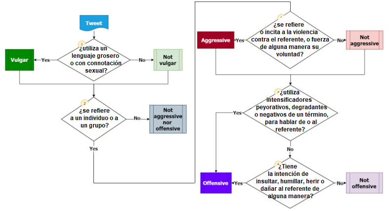

# OffendMex_Dataset
Creación de un dataset con muestras de texto ofensivo, agresivo y/o vulgar realizado en Python.

El dataset se crea con tweets extraídos con la API de Twitter (usando la librería Tweepy para usarla en python) para después ser archivados en un archivo CSV con ayuda de la librería Pandas.

Se incluyen ambas muestras obtenidas con este método las cuales han sido clasificadas manualmente como vulgares, ofensivos y agresivos después de su extracciónbasándonos el siguiente modelo.

